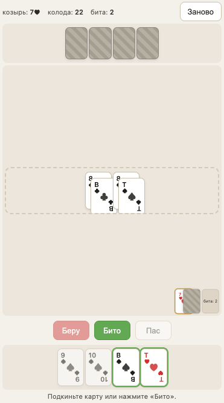

# Дурак

Карточная игра «Переводной дурак» в браузере. Один игрок против компьютера, колода в 36 карт.

Играть онлайн: [begoon.github.io/durak](https://begoon.github.io/durak)



## Правила

Каждому игроку раздаётся по 6 карт, открывается одна карта — её масть становится козырной. Игроки по очереди атакуют друг друга одной или несколькими картами. Защищающийся должен побить каждую карту атаки старшей картой той же масти или любым козырем (козырь бьётся только старшим козырем).

Если защита удалась, карты уходят в биту. Если нет — защищающийся забирает все карты в руку. После раунда оба игрока добирают карты до 6, пока в колоде есть карты. Тот, у кого в конце остаются карты, становится «дураком».

В «Переводном дураке» защищающийся может, вместо того чтобы отбиваться, перевести атаку на следующего игрока, если у него есть карта того же ранга, что и атакующая. Тогда защищаться придётся уже сопернику — вместе со всей кучей, которая лежит на столе.

## Управление

- Тап или перетаскивание карты — сыграть карту.
- Перетащить карту на конкретный слот — отбить именно эту карту.
- Перетащить карту на свободную часть стола — атаковать или перевести.
- Тап на карту, которой можно одновременно отбиться и перевести — откроется диалог с выбором.
- **Беру** — забрать всё со стола.
- **Бито** — закончить раунд после успешной защиты.
- **Пас** — закончить подкидывание, когда соперник берёт.
- **Заново** — начать новую игру.

## Запуск локально

```bash
just run
```

Откройте `http://localhost:8000`.

## Файлы

- `index.html` — разметка страницы.
- `style.css` — оформление, светлая тема, мобильная вёрстка.
- `game.js` — правила игры: колода, ходы, отбой, перевод, конец партии.
- `ai.js` — эвристический компьютерный игрок.
- `ui.js` — отрисовка и ввод (клик + drag-and-drop + touch).

## Лицензия

[MIT](LICENSE)
